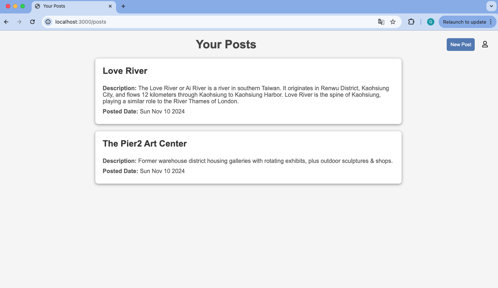

# POST App

A scalable full-stack web application built with Node.js, Express, MongoDB, and Oracle Database, featuring RESTful API endpoints, dynamic EJS views, and environment variable support. 

This project includes a testing suite configured with Mocha, Chai, Sinon, Supertest, and Cheerio for comprehensive testing of backend functionality, API endpoints, and HTML content parsing.

## Technologies Used

1. Node.js: JavaScript runtime for server-side programming.
2. Express: Web framework for building RESTful APIs.
3. MongoDB: NoSQL database for store post data.
4. Oracle Database: Relational database to store user profile data.
5. Mongoose: ODM for MongoDB to model application data.
6. oracledb: Node.js module to interact with Oracle Database.
7. EJS: Template engine for generating dynamic HTML.
8. Dotenv: Manage environment variables.
9. Docker: Deployment of applications within lightweight containers.
10. Docker Compose: Defining and managing multi-container applications.

## Testing Tools

1. Mocha: JavaScript test framework for running tests  
2. Chai: Assertion library for writing test expectations  
3. Sinon: Library for test spies, stubs, and mocks
4. Supertest: HTTP assertions for testing API endpoints  
5. Cheerio: jQuery-like library for parsing and manipulating HTML  

## Application Overview

1. Your post list



2. Create a post


3. View a user profile


## Installation

1. Install dependencies

```bash
npm install
```

2. Create a .env file

3. Setup environment variables

## Scripts

1. Start the server.

```bash
npm start
```

2. Start the server with Nodemon for development

```bash
npm run dev
```

3. Execute the test suite

```bash
npm test
```

4. Builds images, starts containers and attaches logs

```bash
docker-compose up --build
```

Rebuilds images if there have been any changes in the Dockerfiles or dependencies. Launches all services defined in the docker-compose.yml file. Displays the output from each container, allowing you to monitor the application in real-time.

## Reference

Docker: https://www.youtube.com/watch?v=pg19Z8LL06w  
Express: https://www.youtube.com/watch?v=SccSCuHhOw0  
MongoDB: https://www.mongodb.com/docs/manual/introduction/  
Mongoose: https://mongoosejs.com/docs/guide.html   
Oracle: https://www.oracle.com/database/technologies/appdev/quickstartnodeonprem.html  
oracledb: https://node-oracledb.readthedocs.io/en/latest/user_guide/introduction.html  
Mocha: https://mochajs.org/#getting-started   
Chai: https://www.chaijs.com/api/    
Sinon: https://sinonjs.org/  
Supertest: https://www.npmjs.com/package/supertest   
Cheerio: https://cheerio.js.org/docs/intro   